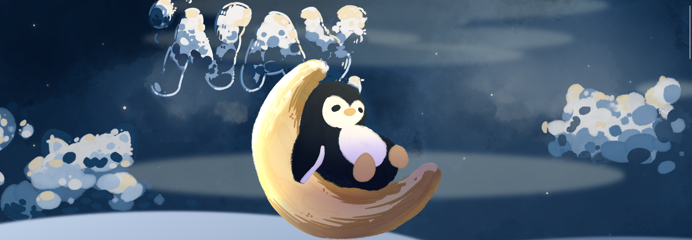

# V2-Portfolio

This is my really very cool personal portfolio!!! In the future, im hopping to add in the art and technology sections, but for now, its a pretty clean single pager. (though right now, its pretty mobile unfriendly... sorry about that ;-;)

Site is Deploy on Git pages :DDD so you can check it out if you want!!!

Features (present)
- cool hover effects
- cool visuals
- simple atmospheric css animations
- Its a portfolio resume thing, so you know, general work experience, about me, ect
- A Nav Bar

Features (future)
- Portfolio sections for both art and tech
- more polish
- GSAP animations for some scroll timeline magic
- Compressed images (right now they are kinda beefy)

Built with: HTML, CSS

Full site was designed by me!!! All the art was hand drawn on procreate;